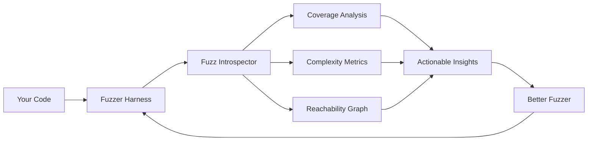
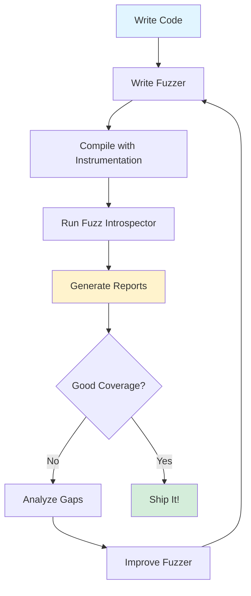

# Tutorial Part 1: Setting Up Fuzz Introspector

## Introduction

Welcome to the Fuzz Introspector tutorial! In this first part, we'll get you set up and ready to analyze your fuzzing harnesses.

## What You'll Learn

- ✅ What Fuzz Introspector is and why you need it
- ✅ How to install Fuzz Introspector
- ✅ Setting up your first project for analysis
- ✅ Understanding the prerequisites

## What is Fuzz Introspector?



Fuzz Introspector analyzes your fuzzing harnesses to help you understand:

- **What code is being tested** (and what isn't)
- **How complex your tested code is** (complexity = bugs)
- **Which functions are reachable** from your fuzzers
- **Where to focus your efforts** for maximum impact

## Prerequisites

### Required Tools

1. **Python 3.11+**
   ```bash
   python3 --version
   # Should output: Python 3.11.x or higher
   ```

2. **Clang/LLVM 15+**
   ```bash
   clang --version
   # Should output: clang version 15.0.0 or higher
   ```

3. **Git**
   ```bash
   git --version
   ```

### Optional but Recommended

- **Docker**: For easy OSS-Fuzz integration
- **Graphviz**: For call graph visualization

## Installation Methods

### Method 1: From Source (Recommended for Development)

```bash
# Clone the repository
git clone https://github.com/ossf/fuzz-introspector.git
cd fuzz-introspector

# Create a virtual environment
python3 -m venv venv
source venv/bin/activate  # On Windows: venv\Scripts\activate

# Install dependencies
pip install -r requirements.txt

# Install fuzz-introspector
cd src
pip install -e .
```

### Method 2: Using pip

```bash
# Create a virtual environment
python3 -m venv fuzz-env
source fuzz-env/bin/activate

# Install fuzz-introspector
pip install fuzz-introspector
```

### Method 3: Using Docker (OSS-Fuzz Integration)

```bash
# Clone OSS-Fuzz
git clone https://github.com/google/oss-fuzz.git
cd oss-fuzz

# Build with introspector enabled
python infra/helper.py build_image your-project
python infra/helper.py build_fuzzers --sanitizer introspector your-project
```

## Verifying Installation

### Test Your Installation

```bash
# Check if fuzz-introspector is installed
python3 -c "import fuzz_introspector; print('Success!')"

# Expected output: Success!
```

### Clone the Demo Project

```bash
# Navigate to the demo directory
cd demo/sample-project

# Verify files exist
ls -la src/
# Should show: sample.c, fuzzer.c, improved-fuzzer.c
```

## Understanding the Workflow



### The Analysis Process

1. **Instrumentation Phase**: Compile your code with special flags
2. **Data Collection Phase**: Run your fuzzer to collect runtime data
3. **Analysis Phase**: Process the collected data
4. **Report Generation**: Create interactive HTML reports
5. **Improvement Phase**: Use insights to enhance your fuzzer

## Configuration

### Basic Configuration File

Create a `fuzz-introspector.config` file:

```yaml
# Fuzz Introspector Configuration
project_name: "my-project"
language: "c"
output_dir: "./reports"
coverage_threshold: 70
complexity_threshold: 15

# Optional: Specify fuzzers
fuzzers:
  - name: "fuzzer1"
    target: "./fuzzer"
  - name: "improved-fuzzer"
    target: "./improved-fuzzer"
```

### Environment Setup

Add to your `.bashrc` or `.zshrc`:

```bash
# Fuzz Introspector environment
export FUZZ_INTROSPECTOR_PATH="/path/to/fuzz-introspector"
export PATH="$FUZZ_INTROSPECTOR_PATH/src:$PATH"

# Clang setup for fuzzing
export CC=clang
export CXX=clang++
export CFLAGS="-fsanitize=fuzzer,address -g -O1"
```

## Quick Start Test

Let's verify everything works with a simple test:

```bash
# Navigate to the sample project
cd demo/sample-project

# Build the basic fuzzer
make fuzzer

# Create a corpus directory
mkdir -p corpus

# Run the fuzzer briefly (10 seconds)
timeout 10 ./fuzzer corpus/ || true

# You should see LibFuzzer output!
```

Expected output:
```
INFO: Seed: 1234567890
INFO: Loaded 1 modules
INFO: -max_len is not provided; libFuzzer will not generate inputs larger than 4096 bytes
INFO: A corpus is not provided, starting from an empty corpus
#2      INITED cov: 12 ft: 13 corp: 1/1b exec/s: 0 rss: 25Mb
#8      NEW    cov: 14 ft: 15 corp: 2/2b lim: 4 exec/s: 0 rss: 25Mb
...
```

## Troubleshooting

### Issue: "clang: command not found"

**Solution**: Install LLVM/Clang
```bash
# Ubuntu/Debian
sudo apt-get install clang

# macOS
brew install llvm

# Fedora
sudo dnf install clang
```

### Issue: "No module named 'fuzz_introspector'"

**Solution**: Activate your virtual environment
```bash
source venv/bin/activate  # or fuzz-env/bin/activate
pip install -e .
```

### Issue: "undefined reference to `LLVMFuzzerTestOneInput`"

**Solution**: Make sure you're using the fuzzing flags
```bash
clang -fsanitize=fuzzer,address -g -O1 sample.c fuzzer.c -o fuzzer
```

## Next Steps

🎉 **Congratulations!** You've set up Fuzz Introspector and verified it works.

Continue to [Part 2: Running Your First Analysis](02-first-analysis.md) where you'll:
- Compile code with full instrumentation
- Generate your first analysis report
- Explore the interactive HTML interface

## Additional Resources

- 📚 [Official Documentation](https://fuzz-introspector.readthedocs.io)
- 🎥 [Video Walkthrough](https://www.youtube.com/watch?v=cheo-liJhuE)
- 💬 [Community Forum](https://github.com/ossf/fuzz-introspector/discussions)
- 🐛 [Report Issues](https://github.com/ossf/fuzz-introspector/issues)

---

**Need Help?** Join our community discussions or check the troubleshooting section in the docs!
