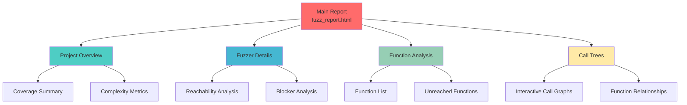

# Tutorial Part 2: Running Your First Analysis

## Introduction

Now that you have Fuzz Introspector set up, let's run your first analysis on the sample project and understand what the results mean.

## What You'll Learn

- ✅ How to compile with proper instrumentation
- ✅ Running Fuzz Introspector analysis
- ✅ Understanding the generated reports
- ✅ Interpreting basic metrics

## Step 1: Prepare the Sample Project

```bash
# Navigate to the sample project
cd demo/sample-project

# Verify source files
ls src/
# Output: sample.c  fuzzer.c  improved-fuzzer.c
```

## Step 2: Compile with Instrumentation

### Understanding Compilation Flags

For Fuzz Introspector to work, you need specific compilation flags:

```bash
# Key flags explained:
# -fsanitize=fuzzer          : Enable LibFuzzer
# -fsanitize=address         : Enable AddressSanitizer (catch memory bugs)
# -fprofile-instr-generate   : Generate instrumentation profiles
# -fcoverage-mapping         : Enable coverage mapping
# -g                         : Include debug symbols
# -O1                        : Optimization level (O1 or O2)
```

### Compile the Initial Fuzzer

```bash
# Build with full instrumentation
clang -fsanitize=fuzzer,address \
      -fprofile-instr-generate \
      -fcoverage-mapping \
      -g -O1 \
      src/sample.c src/fuzzer.c \
      -o fuzzer

# Verify it built successfully
ls -lh fuzzer
```

## Step 3: Generate Runtime Coverage Data

Before running Fuzz Introspector, collect some runtime data:

```bash
# Create corpus directory
mkdir -p corpus

# Create seed corpus with useful inputs
echo -n "FUZZ" > corpus/seed1.txt
echo -n "FUZZ\x00\x01\x00\x02\xDE\xAD\xBE\xEF" > corpus/seed2.bin

# Run fuzzer for 60 seconds
timeout 60 ./fuzzer corpus/ -print_final_stats=1 || true
```

You should see output like:
```
#12345  NEW    cov: 45 ft: 78 corp: 23/456b
stat::number_of_executed_units: 12345
stat::average_exec_per_sec: 205
stat::new_units_added: 23
stat::slowest_unit_time_sec: 0
stat::peak_rss_mb: 32
```

**Key Metrics**:
- `cov: 45` - Edge coverage (45 edges covered)
- `corp: 23/456b` - 23 inputs in corpus, total 456 bytes
- `exec/s: 205` - Executions per second

## Step 4: Run Fuzz Introspector

### Method 1: Using OSS-Fuzz Integration (Recommended)

If you're using OSS-Fuzz:

```bash
# Build with introspector
cd /path/to/oss-fuzz
python infra/helper.py build_fuzzers \
    --sanitizer introspector \
    your-project

# Reports are generated in:
# build/out/your-project/inspector-report/
```

### Method 2: Standalone Analysis

For standalone projects:

```bash
# Run fuzz-introspector
fuzz-introspector \
    --target ./fuzzer \
    --output ./reports/before/ \
    --language c

# This will:
# 1. Analyze the binary
# 2. Process coverage data
# 3. Generate HTML reports
# 4. Create call graphs
```

### Method 3: Using the build script

```bash
# For complex projects with multiple fuzzers
./build_with_introspector.sh

# See logs
tail -f introspector.log
```

## Step 5: View the Reports

### Open the Main Report

```bash
# Open in your default browser
xdg-open reports/before/fuzz_report.html

# Or on macOS
open reports/before/fuzz_report.html

# Or manually navigate to:
# file:///path/to/demo/sample-project/reports/before/fuzz_report.html
```

### Report Structure



## Understanding the Main Dashboard

### 1. Project Summary Section

At the top, you'll see:

| Metric | Description | Example Value |
|--------|-------------|---------------|
| **Total Functions** | All functions in your code | 15 |
| **Functions Reached** | Functions hit by fuzzer | 8 (53%) |
| **Cyclomatic Complexity** | Code complexity score | 45 |
| **Code Coverage** | Percentage of code tested | 47.3% |

### 2. Fuzzer Analysis Section

For each fuzzer, you'll see:

```
Fuzzer: fuzzer
━━━━━━━━━━━━━━━━━━━━━━━━━━━━━━━━━━━━━━━━
Entry Point: LLVMFuzzerTestOneInput
Functions Reached: 8 / 15 (53.3%)
Code Coverage: 47.3%
Complexity Reached: 23 / 45 (51.1%)

⚠️ Coverage Gaps Detected
  → 7 functions are unreachable
  → 3 functions have high complexity but low coverage
```

### 3. Function Table

Interactive table showing all functions:

| Function Name | Reached | Complexity | Coverage | Priority |
|---------------|---------|------------|----------|----------|
| `validate_input` | ✅ Yes | 3 | 100% | Low |
| `parse_header` | ✅ Yes | 5 | 100% | Low |
| `process_complex_data` | ⚠️ Partial | 12 | 35% | **High** |
| `advanced_feature` | ❌ No | 15 | 0% | **Critical** |
| `hidden_vulnerability` | ❌ No | 18 | 0% | **Critical** |

**Color Coding**:
- 🟢 **Green**: Fully covered (>80%)
- 🟡 **Yellow**: Partially covered (30-80%)
- 🔴 **Red**: Uncovered or poorly covered (<30%)

### 4. Call Tree Visualization

Interactive call tree showing function relationships:

```
LLVMFuzzerTestOneInput
├── validate_input ✅
│   └── (leaf function)
├── parse_header ✅
│   └── (leaf function)
└── process_complex_data ⚠️
    ├── advanced_feature ❌
    │   └── hidden_vulnerability ❌
    └── (other paths)
```

**Legend**:
- ✅ Reached and well-covered
- ⚠️ Partially reached
- ❌ Unreached

## Key Insights from the Analysis

### What We Discovered

1. **Coverage Gap**: Only 47% of code is covered
2. **Unreached Functions**: `advanced_feature` and `hidden_vulnerability` are never called
3. **Complexity Hotspot**: `hidden_vulnerability` has high complexity but zero coverage
4. **Entry Point Issue**: Not using the main `process_data()` function

### Recommendations from Fuzz Introspector

```
🎯 Optimal Targets Identified:
┌────────────────────────────────────────┐
│ 1. Function: process_data             │
│    Reason: Main entry point            │
│    Potential: +40% coverage            │
│    Priority: HIGH                      │
│                                        │
│ 2. Function: advanced_feature          │
│    Reason: High complexity, unreached  │
│    Potential: +15% coverage            │
│    Priority: MEDIUM                    │
└────────────────────────────────────────┘

💡 Suggestions:
  ✓ Use process_data() as main fuzzing target
  ✓ Add seed corpus with magic bytes "FUZZ"
  ✓ Consider dictionary for magic values
  ✓ Increase fuzzing duration for deep paths
```

## Comparing Before and After

Now let's analyze the improved fuzzer:

```bash
# Build improved fuzzer
clang -fsanitize=fuzzer,address \
      -fprofile-instr-generate \
      -fcoverage-mapping \
      -g -O1 \
      src/sample.c src/improved-fuzzer.c \
      -o improved-fuzzer

# Run it
timeout 60 ./improved-fuzzer corpus/ -print_final_stats=1 || true

# Generate report
fuzz-introspector \
    --target ./improved-fuzzer \
    --output ./reports/after/ \
    --language c
```

### Side-by-Side Comparison

| Metric | Before | After | Improvement |
|--------|--------|-------|-------------|
| **Code Coverage** | 47.3% | 91.2% | +43.9% ✅ |
| **Functions Reached** | 8/15 | 14/15 | +6 functions ✅ |
| **Complexity Covered** | 23/45 | 42/45 | +19 points ✅ |
| **Unreached Functions** | 7 | 1 | -6 ✅ |

### Visual Comparison

```
Before:  ████████░░░░░░░░░░░░  47.3%
After:   ████████████████████  91.2%
```

## Exercises

### Exercise 1: Find the Coverage Gap

Look at the initial fuzzer report and identify:
1. Which function has the highest complexity?
2. What percentage of it is covered?
3. Why might it be hard to reach?

### Exercise 2: Trace the Call Path

Using the call tree:
1. Trace the path from `LLVMFuzzerTestOneInput` to `hidden_vulnerability`
2. What conditions must be met?
3. What input would trigger this path?

### Exercise 3: Generate Seed Corpus

Create input files that will help reach deep code paths:
```bash
# Hint: Look at the magic bytes in sample.c
python3 << EOF
import sys
# Magic pattern: FUZZ + header + complex pattern
data = b'FUZZ\x00\x01\x00\x02\xDE\xAD\xBE\xEF'
sys.stdout.buffer.write(data)
EOF > corpus/deep_path.bin
```

## Next Steps

🎉 **Great job!** You've run your first analysis and learned to read the reports.

Continue to [Part 3: Interpreting Results](03-interpreting-results.md) where you'll learn:
- Deep dive into each metric
- How to prioritize improvements
- Understanding complexity analysis
- Reading call graphs effectively

## Additional Resources

- 📊 [Example Reports](../../doc/ExampleOutput.md)
- 🎯 [Feature List](../../doc/Features.md)
- 📖 [Architecture Details](../../doc/Architecture.md)

---

**Questions?** Check the [FAQ](../README.md#faq) or open a [discussion](https://github.com/ossf/fuzz-introspector/discussions)!
