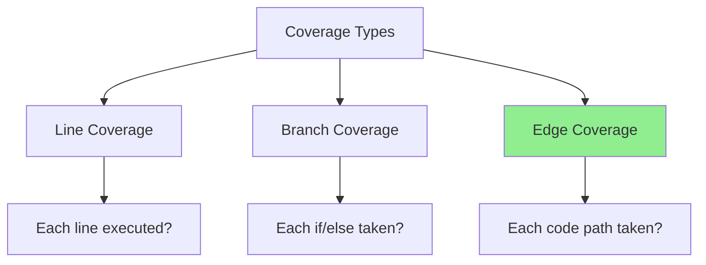
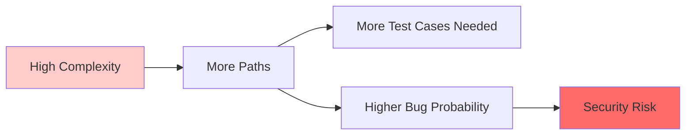
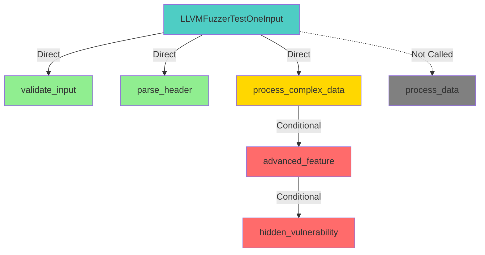

# Tutorial Part 3: Interpreting Results

## Introduction

Understanding Fuzz Introspector reports is key to improving your fuzzing. In this part, we'll dive deep into each metric and learn how to extract actionable insights.

## What You'll Learn

- ✅ Deep understanding of each metric
- ✅ How to identify critical coverage gaps
- ✅ Reading complexity analysis
- ✅ Interpreting call graphs
- ✅ Prioritizing improvements

## Key Metrics Explained

### 1. Code Coverage

**Definition**: Percentage of code (lines, branches, or edges) executed by your fuzzer.

```
Code Coverage = (Executed Code Elements) / (Total Code Elements) × 100%
```

#### Coverage Types



**Edge coverage** (used by LibFuzzer) is most comprehensive.

#### Interpreting Coverage Scores

| Coverage % | Assessment | Action Needed |
|------------|------------|---------------|
| **90-100%** | ✅ Excellent | Maintain, look for edge cases |
| **70-89%** | 🟡 Good | Find specific gaps, improve |
| **50-69%** | 🟠 Fair | Significant work needed |
| **<50%** | 🔴 Poor | Major fuzzer redesign required |

#### Example Analysis

From our sample project:

```
Initial Fuzzer Coverage: 47.3%
━━━━━━━━━━━━━━━━━━━━━━━━━━━━━━━━━━━━━━━
Breakdown:
  validate_input()        : 100% ✅
  parse_header()          : 100% ✅
  process_complex_data()  :  35% ⚠️  ← Problem!
  advanced_feature()      :   0% ❌  ← Critical!
  hidden_vulnerability()  :   0% ❌  ← Critical!
```

**Insight**: Focus on improving `process_complex_data()` reachability.

### 2. Cyclomatic Complexity

**Definition**: Measure of code complexity based on number of independent paths.

```
Complexity = Edges - Nodes + 2 × Connected_Components
```

Simplified: Count decision points (if, while, for, switch, &&, ||) + 1

#### Complexity Scale

```
1-5   : Simple, low risk        🟢
6-10  : Moderate complexity     🟡
11-20 : Complex, higher risk    🟠
21+   : Very complex, high risk 🔴
```

#### Why Complexity Matters



**Research shows**: Bugs increase exponentially with complexity.

#### Example Analysis

```
hidden_vulnerability() - Complexity: 18
━━━━━━━━━━━━━━━━━━━━━━━━━━━━━━━━━━━━━━━
Decision points:
  1. if (size < 50)
  2. if (memcmp(data, "FUZZ", 4) == 0)
  3. if (data[8] == 0xDE && data[9] == 0xAD)    ← 2 conditions
  4. if (data[10] == 0xBE && data[11] == 0xEF)  ← 2 conditions
  5. if (data[20] == 0xCA && data[21] == 0xFE)  ← 2 conditions
  6. if (data[22] == 0xBA && data[23] == 0xBE)  ← 2 conditions
  7. if (data[30] == 0x99 && data[31] == 0x88)  ← 2 conditions
  8. if (copy_size < 100)

Total: 18 complexity points ← High risk, must test!
```

### 3. Reachability Analysis

**Definition**: Which functions can be called from your fuzzer's entry point.



#### Reachability Categories

1. **Directly Reachable** (Green): Called immediately
2. **Conditionally Reachable** (Yellow): Called under conditions
3. **Unreachable** (Red): Never called
4. **Not Called** (Gray): Function exists but not in call tree

#### Finding Unreachable Code

Look for:
- Functions never appearing in call tree
- High complexity + zero coverage
- Public APIs never tested
- Error handling paths

### 4. Function Priority Analysis

Fuzz Introspector ranks functions by priority:

```
Priority Score = (Complexity × Risk Factor) / (Coverage + 1)
```

#### Priority Levels

```
🔴 CRITICAL: High complexity + Zero coverage + Reachable
🟠 HIGH:     Medium complexity + Low coverage + Important
🟡 MEDIUM:   Any complexity + Partial coverage
🟢 LOW:      Low complexity + Good coverage
```

#### Example Priority Table

| Function | Complexity | Coverage | Reachability | Priority | Action |
|----------|------------|----------|--------------|----------|--------|
| `hidden_vulnerability` | 18 | 0% | Conditional | 🔴 CRITICAL | Must test! |
| `advanced_feature` | 15 | 0% | Conditional | 🔴 CRITICAL | Must test! |
| `process_complex_data` | 12 | 35% | Direct | 🟠 HIGH | Improve |
| `parse_header` | 5 | 100% | Direct | 🟢 LOW | OK |
| `validate_input` | 3 | 100% | Direct | 🟢 LOW | OK |

## Reading Call Graphs

### Static Call Graph

Shows all possible calls based on code structure:

```
process_data()
├── validate_input()
│   └── [leaf]
├── parse_header()
│   └── [leaf]
├── process_complex_data()
│   ├── advanced_feature()
│   │   └── hidden_vulnerability()
│   └── [other paths]
└── hidden_vulnerability()
    └── memcpy() ⚠️ (system call)
```

### Dynamic Call Graph

Shows actual calls during fuzzing:

```
LLVMFuzzerTestOneInput()
├── validate_input() ✅ (1000+ calls)
├── parse_header() ✅ (1000+ calls)
└── process_complex_data() ⚠️ (1000+ calls)
    └── advanced_feature() ❌ (0 calls) ← Problem!
        └── hidden_vulnerability() ❌ (0 calls)
```

### Identifying Blockers

**Blocker**: A condition preventing deeper code from being reached.

```c
int process_complex_data(const uint8_t *data, size_t size) {
    if (size < 20) return -1;  // ← Blocker #1
    
    if (data[0] == 'F' && data[1] == 'U' &&   // ← Blocker #2
        data[2] == 'Z' && data[3] == 'Z') {
        
        if (data[8] == 0xDE && data[9] == 0xAD) {  // ← Blocker #3
            // advanced_feature() called here
        }
    }
}
```

**Insight**: Need inputs with "FUZZ" + 0xDEAD to reach deeper code.

## Coverage Visualization

### Heatmap Interpretation

```
File: sample.c
━━━━━━━━━━━━━━━━━━━━━━━━━━━━━━━━━━━━━━━
Line  Coverage  Code
━━━━━━━━━━━━━━━━━━━━━━━━━━━━━━━━━━━━━━━
5     1000×     int validate_input(...) {
6     1000×         if (size < 4) {
7      200×             return 0;
8                     }
9      800×         if (data[0] == 'F' ...) {
...
45      0×       void hidden_vulnerability(...) {
46      0×           if (size < 50) {
47      0×               return;
```

**Color Legend**:
- 🟢 Green (1000×+): Hot path, well-tested
- 🟡 Yellow (1-999×): Tested but infrequent
- 🔴 Red (0×): Never executed

## Analyzing Specific Functions

### Case Study: `hidden_vulnerability()`

```
Function: hidden_vulnerability
━━━━━━━━━━━━━━━━━━━━━━━━━━━━━━━━━━━━━━━
Complexity:     18 (Very High) 🔴
Coverage:       0%
Called by:      process_data() (conditionally)
Calls:          memcpy() (dangerous!)
Risk Level:     CRITICAL
Lines of Code:  25
Blockers:       7 nested conditions

⚠️  SECURITY CONCERN:
    Buffer overflow vulnerability detected!
    Line 127: memcpy(buffer, data + 33, copy_size);
    User-controlled size with weak validation.

🎯 Recommendation:
    1. Add seed corpus with magic bytes
    2. Use fuzzer dictionary for patterns
    3. Increase max_len to allow larger inputs
    4. Consider targeted fuzzing campaign
```

## Optimal Target Identification

Fuzz Introspector suggests optimal fuzzing targets:

### Scoring Algorithm

```python
def calculate_target_score(function):
    score = 0
    
    # Complexity contribution (40%)
    score += function.complexity * 0.4
    
    # Uncovered code (30%)
    uncovered_lines = function.total_lines - function.covered_lines
    score += uncovered_lines * 0.3
    
    # Reachability depth (20%)
    score += function.call_depth * 0.2
    
    # Risk factors (10%)
    if function.has_external_calls:
        score += 10
    if function.has_unsafe_operations:
        score += 20
    
    return score
```

### Example Ranking

```
🥇 Rank 1: process_data()
   Score: 85/100
   Reason: Main entry point, reaches most code
   Expected gain: +40% coverage

🥈 Rank 2: advanced_feature()
   Score: 72/100
   Reason: High complexity, completely unreached
   Expected gain: +15% coverage

🥉 Rank 3: process_complex_data()
   Score: 58/100
   Reason: Partially covered, blocks deeper functions
   Expected gain: +10% coverage
```

## Actionable Insights Checklist

Use this checklist when reviewing reports:

### ✅ Coverage Analysis
- [ ] Overall coverage >70%?
- [ ] All critical functions covered?
- [ ] Any functions with 0% coverage?
- [ ] Coverage trending up over time?

### ✅ Complexity Analysis
- [ ] High-complexity functions tested?
- [ ] Complexity hotspots identified?
- [ ] Risk proportional to testing?

### ✅ Reachability Analysis
- [ ] All public APIs reached?
- [ ] Deep code paths accessible?
- [ ] Blockers identified and addressed?

### ✅ Priority Actions
- [ ] Critical functions in test plan?
- [ ] Seed corpus created for deep paths?
- [ ] Dictionary prepared for magic values?

## Common Patterns and Solutions

### Pattern 1: Magic Byte Blocker

**Problem**: Code requires specific byte patterns
```c
if (data[0] == 'M' && data[1] == 'Z') { ... }
```

**Solution**: 
- Add to fuzzer dictionary
- Create seed corpus
- Use structure-aware fuzzing

### Pattern 2: Size Checks

**Problem**: Code requires minimum input size
```c
if (size < 100) return;
```

**Solution**:
- Increase `-max_len` parameter
- Add larger seeds to corpus
- Use `-len_control=0` for size exploration

### Pattern 3: Checksum Validation

**Problem**: Code validates checksums/hashes
```c
if (calculate_crc(data) != expected_crc) return;
```

**Solution**:
- Mock checksum functions during fuzzing
- Use custom mutator to maintain valid checksums
- Consider structure-aware fuzzing (libprotobuf-mutator)

## Next Steps

🎉 **Excellent!** You now understand how to interpret Fuzz Introspector reports.

Continue to [Part 4: Improving Your Fuzzer](04-improving-fuzzer.md) where you'll learn:
- How to act on insights
- Writing better fuzzers
- Creating effective seed corpus
- Advanced fuzzing techniques

## Additional Resources

- 📊 [Case Studies](../../doc/CaseStudies.md)
- 🎯 [Feature Documentation](../../doc/Features.md)
- 📖 [Glossary](../../doc/Glossary.md)

---

**Pro Tip**: Focus on high complexity + low coverage functions first for maximum impact!
