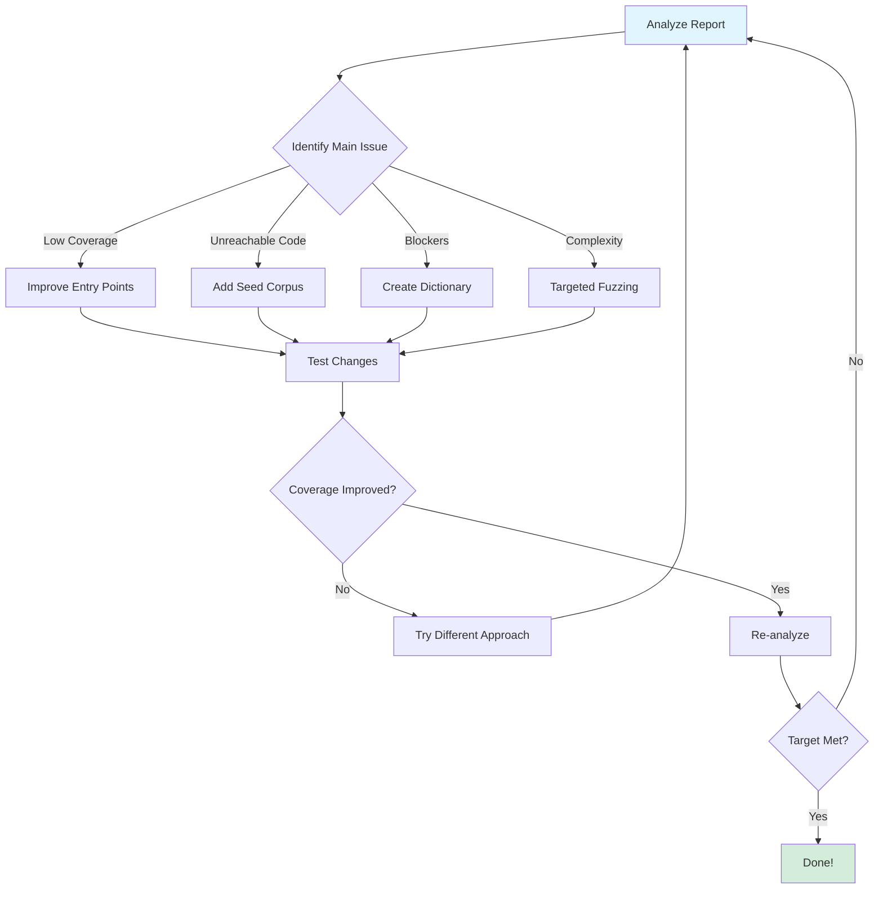
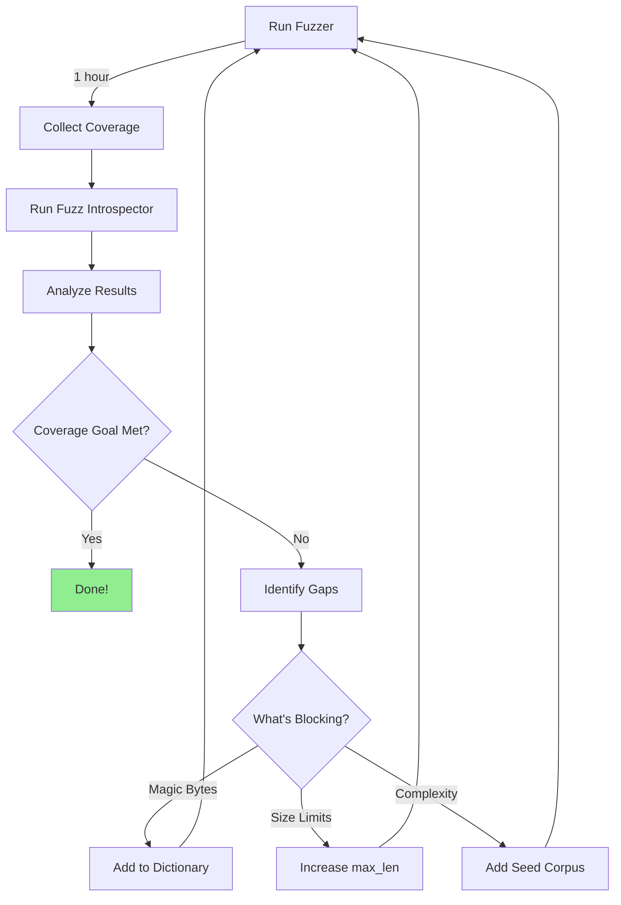

# Tutorial Part 4: Improving Your Fuzzer

## Introduction

Now that you understand the metrics, let's put that knowledge into action! This final part shows you how to systematically improve your fuzzer based on Fuzz Introspector insights.

## What You'll Learn

- ✅ How to act on analysis insights
- ✅ Writing effective fuzzers
- ✅ Creating powerful seed corpus
- ✅ Using fuzzer dictionaries
- ✅ Advanced optimization techniques

## The Improvement Process



## Step 1: Fix Entry Point Issues

### Problem: Wrong Entry Point

From our analysis, the initial fuzzer tested functions individually:

```c
// ❌ BAD: Testing functions separately
int LLVMFuzzerTestOneInput(const uint8_t *data, size_t size) {
    validate_input(data, size);
    parse_header(data, size);
    process_complex_data(data, size);
    return 0;
}
```

**Issues**:
- Functions don't interact
- Missing coordinated logic
- No shared state between calls

### Solution: Use Main Entry Point

```c
// ✅ GOOD: Using coordinated entry point
int LLVMFuzzerTestOneInput(const uint8_t *data, size_t size) {
    process_data(data, size);  // Orchestrates all functions
    return 0;
}
```

**Benefits**:
- Natural function interactions
- Shared state preserved
- Real-world usage patterns

### When to Call Multiple Functions

Sometimes you DO want multiple calls:

```c
// ✅ GOOD: Testing different modes
int LLVMFuzzerTestOneInput(const uint8_t *data, size_t size) {
    if (size < 1) return 0;
    
    uint8_t mode = data[0];
    const uint8_t *payload = data + 1;
    size_t payload_size = size - 1;
    
    switch(mode % 3) {
        case 0: parse_mode_a(payload, payload_size); break;
        case 1: parse_mode_b(payload, payload_size); break;
        case 2: parse_mode_c(payload, payload_size); break;
    }
    
    return 0;
}
```

## Step 2: Create Effective Seed Corpus

### Understanding Seed Corpus

```
Seed Corpus = Initial inputs that guide fuzzing
├── Valid inputs (pass basic checks)
├── Edge cases (boundary conditions)
├── Magic patterns (special byte sequences)
└── Diverse examples (different code paths)
```

### Creating Seeds for Our Sample

Based on our analysis, we need:

```bash
#!/bin/bash
# create_seeds.sh

mkdir -p corpus

# Seed 1: Valid magic bytes
echo -n "FUZZ" > corpus/seed1.bin

# Seed 2: Valid header
printf "FUZZ\x00\x01\x00\x02" > corpus/seed2.bin

# Seed 3: Reach process_complex_data deep path
printf "FUZZ\x00\x01\x00\x02\xDE\xAD\xBE\xEF" > corpus/seed3.bin

# Seed 4: Reach advanced_feature
printf "FUZZ\x00\x01\x00\x02\xDE\xAD\xBE\xEF\x00\x00\x00\x00\x00\x00\x00\x00\xCA\xFE\xBA\xBE" > corpus/seed4.bin

# Seed 5: Larger input for size checks
printf "FUZZ\x00\x01\x00\x02\xDE\xAD\xBE\xEF\x00\x00\x00\x00\x00\x00\x00\x00\xCA\xFE\xBA\xBE\x00\x00\x00\x00\x00\x00\x99\x88\x10" > corpus/seed5.bin
printf "\x00\x00\x00\x00\x00\x00\x00\x00\x00\x00\x00\x00\x00\x00\x00\x00\x00\x00\x00\x00\x00" >> corpus/seed5.bin

echo "Created $(ls corpus/ | wc -l) seed files"
```

Run it:
```bash
chmod +x create_seeds.sh
./create_seeds.sh
```

### Seed Quality Metrics

```
Good Seed Corpus:
✅ Reaches multiple code paths
✅ Triggers different behaviors
✅ Includes edge cases
✅ Small enough to mutate effectively (typically <1KB)
✅ Diverse - each seed adds unique coverage

Bad Seed Corpus:
❌ All seeds exercise same code path
❌ Too large (>10KB) - slow mutations
❌ Invalid inputs that fail immediately
❌ Random data with no structure
```

## Step 3: Use Fuzzer Dictionaries

### What is a Dictionary?

A dictionary helps LibFuzzer find magic values faster:

```
Dictionary = List of interesting byte sequences
├── Magic numbers (0xDEADBEEF, 0xCAFEBABE)
├── Keywords ("FUZZ", "HTTP", "PNG")
├── Common values (0, -1, 0xFFFFFFFF)
└── Format-specific tokens
```

### Creating a Dictionary

For our sample project:

```bash
cat > fuzzer.dict << 'EOF'
# Magic header
magic_fuzz="FUZZ"

# Complex data patterns
magic_dead="\xDE\xAD"
magic_beef="\xBE\xEF"

# Advanced feature patterns
magic_cafe="\xCA\xFE"
magic_babe="\xBA\xBE"

# Hidden vulnerability trigger
magic_9988="\x99\x88"

# Combined patterns (optional but helpful)
pattern_complex="\xDE\xAD\xBE\xEF"
pattern_advanced="\xCA\xFE\xBA\xBE"

# Size-related values
size_small="\x00\x00\x00\x10"
size_medium="\x00\x00\x00\x64"
size_large="\x00\x00\x01\x00"
EOF
```

### Using the Dictionary

```bash
# Run with dictionary
./improved-fuzzer corpus/ -dict=fuzzer.dict -max_total_time=300

# You should see much faster deep-path discovery!
```

### Dictionary Best Practices

```
✅ DO:
- Include all magic constants from code
- Add common edge values (0, -1, MAX_INT)
- Keep entries short (<32 bytes)
- Use descriptive names
- Update as you discover new patterns

❌ DON'T:
- Include random values
- Make entries too long
- Duplicate entries
- Include invalid patterns
```

## Step 4: Optimize Fuzzer Parameters

### Key LibFuzzer Parameters

```bash
# Coverage optimization
-max_len=10000              # Maximum input size
-len_control=100            # How much to vary size
-shrink=1                   # Minimize crashing inputs

# Performance tuning
-jobs=8                     # Parallel fuzzing jobs
-workers=8                  # Parallel workers
-max_total_time=3600        # Run for 1 hour

# Corpus management
-merge=1                    # Merge corpus after run
-minimize_crash=1           # Minimize crash samples
-reload=1                   # Reload corpus periodically

# Deep path exploration
-use_value_profile=1        # Track integer comparisons
-reduce_inputs=1            # Minimize corpus inputs
```

### Recommended Configuration

For our sample project:

```bash
#!/bin/bash
# run_improved_fuzzer.sh

# Create directories
mkdir -p corpus logs crashes

# Run with optimized parameters
./improved-fuzzer \
    corpus/ \
    -dict=fuzzer.dict \
    -max_len=1024 \
    -len_control=100 \
    -use_value_profile=1 \
    -shrink=1 \
    -jobs=4 \
    -max_total_time=3600 \
    -print_final_stats=1 \
    -artifact_prefix=crashes/ \
    2>&1 | tee logs/fuzzer_$(date +%Y%m%d_%H%M%S).log
```

## Step 5: Iterative Improvement

### The Improvement Loop



### Measuring Progress

Track these metrics over iterations:

```
Iteration 1 (Initial Fuzzer):
├── Coverage:     47.3%
├── Functions:    8/15 reached
├── Complexity:   23/45 covered
└── Crashes:      0

Iteration 2 (After fixing entry point):
├── Coverage:     68.5% (+21.2%)
├── Functions:    11/15 reached (+3)
├── Complexity:   35/45 covered (+12)
└── Crashes:      0

Iteration 3 (After adding seeds + dict):
├── Coverage:     91.2% (+22.7%)
├── Functions:    14/15 reached (+3)
├── Complexity:   42/45 covered (+7)
└── Crashes:      1 (buffer overflow found!)
```

## Step 6: Handle Special Cases

### Case 1: Checksum Validation

**Problem**: Code validates checksums before processing

```c
uint32_t crc = calculate_crc(data, size - 4);
uint32_t expected = *(uint32_t*)(data + size - 4);
if (crc != expected) return -1;  // ← Blocker!
```

**Solutions**:

Option A: Mock the function (testing)
```c
#ifdef FUZZING_BUILD_MODE_UNSAFE_FOR_PRODUCTION
uint32_t calculate_crc(const uint8_t *data, size_t size) {
    return 0xDEADBEEF;  // Always return same value
}
#endif
```

Option B: Custom mutator (production)
```c
extern "C" size_t LLVMFuzzerCustomMutator(
    uint8_t *Data, size_t Size, size_t MaxSize, unsigned int Seed) {
    
    // Mutate data
    size_t NewSize = LLVMFuzzerMutate(Data, Size, MaxSize);
    
    // Fix checksum
    if (NewSize > 4) {
        uint32_t crc = calculate_crc(Data, NewSize - 4);
        memcpy(Data + NewSize - 4, &crc, 4);
    }
    
    return NewSize;
}
```

### Case 2: State-Dependent Code

**Problem**: Functions require specific calling order

```c
initialize();
configure(options);
process(data);  // ← Only works if initialized
```

**Solution**: Structure-aware fuzzing

```c
int LLVMFuzzerTestOneInput(const uint8_t *data, size_t size) {
    if (size < 2) return 0;
    
    // Always initialize first
    initialize();
    
    // Use first byte for options
    uint8_t options = data[0];
    configure(options);
    
    // Process remaining data
    process(data + 1, size - 1);
    
    // Clean up
    cleanup();
    
    return 0;
}
```

### Case 3: Multi-Step Protocols

**Problem**: Need sequence of operations

**Solution**: Protocol fuzzer

```c
int LLVMFuzzerTestOneInput(const uint8_t *data, size_t size) {
    FuzzedDataProvider fdp(data, size);
    
    // Connect
    if (!connect_protocol()) return 0;
    
    // Send multiple messages
    while (fdp.remaining_bytes() > 0) {
        uint8_t msg_type = fdp.ConsumeIntegral<uint8_t>();
        auto payload = fdp.ConsumeBytes<uint8_t>(
            fdp.ConsumeIntegralInRange<size_t>(0, 256)
        );
        
        send_message(msg_type, payload.data(), payload.size());
    }
    
    // Disconnect
    disconnect_protocol();
    return 0;
}
```

## Step 7: Validate Improvements

### Re-run Analysis

```bash
# Run improved fuzzer
timeout 300 ./improved-fuzzer corpus/ -dict=fuzzer.dict

# Generate new report
fuzz-introspector \
    --target ./improved-fuzzer \
    --output ./reports/after/ \
    --language c

# Compare with before
diff -u \
    <(grep "Coverage:" reports/before/summary.txt) \
    <(grep "Coverage:" reports/after/summary.txt)
```

### Success Criteria

✅ **Coverage Goals Met**:
- Critical functions >80% coverage
- Overall coverage >70%
- High-complexity functions tested

✅ **Quality Improvements**:
- New crashes found (good for finding bugs!)
- Deeper code paths reached
- Reduced unreachable code

✅ **Performance**:
- Executions per second maintained
- Corpus size manageable (<10K files)
- No timeout/OOM issues

## Best Practices Summary

### ✅ Do This

1. **Start Simple**: Basic fuzzer first, then optimize
2. **Use Main Entry Points**: Real-world usage patterns
3. **Leverage Seed Corpus**: Guide fuzzer to interesting code
4. **Create Dictionaries**: Speed up magic value discovery
5. **Iterate**: Measure, analyze, improve, repeat
6. **Focus on High-Value Targets**: Complexity + low coverage
7. **Monitor Progress**: Track metrics over time

### ❌ Avoid This

1. **Don't Prematurely Optimize**: Get coverage first
2. **Don't Ignore Analysis**: Insights are actionable
3. **Don't Overcomplicate**: Simple fuzzers often work best
4. **Don't Fuzz Everything**: Focus on critical code
5. **Don't Forget Cleanup**: Memory leaks slow fuzzing
6. **Don't Skip Seed Corpus**: Random data is inefficient

## Real-World Examples

### Example 1: OpenSSL

**Problem**: Heartbleed vulnerability
- Located in deeply nested TLS code
- Required specific handshake sequence
- Poor fuzzing coverage

**Solution**:
- Structure-aware TLS fuzzer
- Seed corpus with valid handshakes
- Dictionary with TLS constants
- Result: Vulnerability found in minutes

### Example 2: ImageMagick

**Problem**: Multiple image parsers, complex formats
- 100+ image formats
- Deep parser logic
- Many magic bytes

**Solution**:
- Format-specific fuzzers
- Real image files as seeds
- File format dictionaries
- Result: 50+ vulnerabilities found

## Your Turn: Exercise

### Challenge

Modify the sample project to add a new vulnerability:

```c
// Add to sample.c
void secret_function(const uint8_t *data, size_t size) {
    if (size > 60 && memcmp(data + 50, "SECRET", 6) == 0) {
        // Vulnerability here
        printf("Secret found!\n");
    }
}
```

**Tasks**:
1. Update `process_data()` to call `secret_function()`
2. Run fuzz-introspector
3. Create seeds to reach it
4. Add dictionary entries
5. Measure coverage improvement

## Conclusion

🎉 **Congratulations!** You've completed the tutorial!

You now know how to:
- ✅ Set up fuzz-introspector
- ✅ Run and interpret analyses
- ✅ Identify coverage gaps
- ✅ Systematically improve fuzzers
- ✅ Create effective seed corpus
- ✅ Use advanced techniques

## Next Steps

### Continue Learning
- 📚 [Advanced Features](../../doc/Features.md)
- 🔬 [Case Studies](../../doc/CaseStudies.md)
- 🏗️ [Architecture Deep Dive](../../doc/Architecture.md)

### Join the Community
- 💬 [GitHub Discussions](https://github.com/ossf/fuzz-introspector/discussions)
- 🐛 [Report Issues](https://github.com/ossf/fuzz-introspector/issues)
- 🤝 [Contribute](../../CODE_OF_CONDUCT.md)

### Apply to Your Projects
- Start with one project
- Set coverage goals (>70%)
- Iterate weekly
- Share your results!

## Additional Resources

- 🎥 [Video Walkthrough](https://www.youtube.com/watch?v=cheo-liJhuE)
- 🌐 [OSS-Fuzz Integration](https://introspector.oss-fuzz.com)
- 📖 [Full Documentation](https://fuzz-introspector.readthedocs.io)

---

**Questions or feedback?** Open a [discussion](https://github.com/ossf/fuzz-introspector/discussions) or join our community calls!

**Happy Fuzzing! 🚀**
